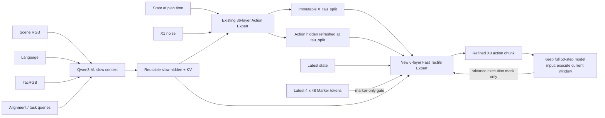

# VTLA Cascaded Tactile Flow

This branch implements two consecutive Flow Matching intervals rather than a
residual controller or a tactile-triggered full replan.



## Flow intervals

With the default configuration:

```text
Slow Action Expert:   tau = 1.0, 0.9, 0.8, 0.7, 0.6, 0.5 -> X_0.4
Fast Tactile Expert:  tau = 0.4, 0.3, 0.2, 0.1      -> X_0
```

Both experts use the original Flow Matching target `u = noise - action`.
Training samples one time from each interval in every batch and reports
`loss/slow_fm` and `loss/tactile_fm` separately.

## Online invariant

For a single slow plan, every Marker update starts from the same immutable
`X_tau_split`:

```text
Marker_t,   State_t   + X_tau_split -> refined chunk t
Marker_t+1, State_t+1 + X_tau_split -> refined chunk t+1
```

The second refinement never starts from the first refined output. ViT,
Qwen3-VL, and the 36-layer Action Expert are not rerun until a new slow context
or slow action plan is requested.

Every Fast pass keeps the model input at the trained 50-step horizon. Each
action token receives a deterministic absolute step-position encoding. After
each Euler update, already executed prefix entries are restored from the
previous valid `X0` chunk; the remaining entries continue from the immutable
`X_tau_split`. The previous `X0` is never used as the next Flow Matching
starting state.

At the end of the Slow integration, the original Action Expert is evaluated
once more at the actual `X_tau_split`. Its 50 final action hidden states are
stored in `SlowActionPlan.action_context`. Every Fast layer has a dedicated
cross-attention over this plan context, in addition to Marker and Slow VLM
context attention.

This adds trainable `plan_norm` and `plan_attention` parameters. A checkpoint
from before this change may be used as a training initializer, but it is not a
valid inference checkpoint until these new parameters have been trained. The
deployment loader rejects such partially upgraded checkpoints explicitly.

## Gate and query semantics

- The contact gate masks only Marker tokens.
- TacRGB and alignment/task queries are never gated.
- Gate OFF still runs the Fast Tactile Expert using State, `X_tau_split`, and
  slow context, with an all-false Marker mask.
- Future-query tokens are masked from the Fast Tactile Expert to prevent
  training-time target leakage.

## Deployment state machine

```text
POST /context/refresh  -> context_version, invalidates prior plan
POST /action/plan      -> plan_version, stores immutable X_tau_split
POST /action/refine    -> validates session/context/plan/offset, returns X0
```

The Realman client advances an absolute action offset, for example `[2,4)`,
then `[4,6)`. The offset controls prefix restoration and execution selection;
it no longer changes the Fast model's token count. When the 50-step plan is
exhausted, the client refreshes the current Scene/TacRGB Slow context before
creating a new Slow Action Plan. The existing `/predict`, `/context/refresh`,
and `/predict_fast` paths remain available for the `full_replan` baseline.
